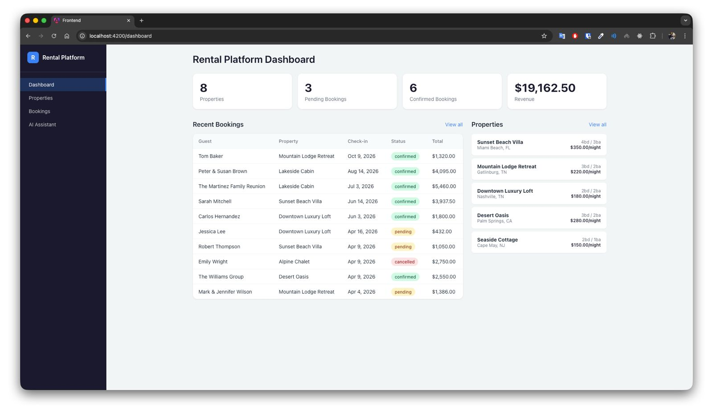
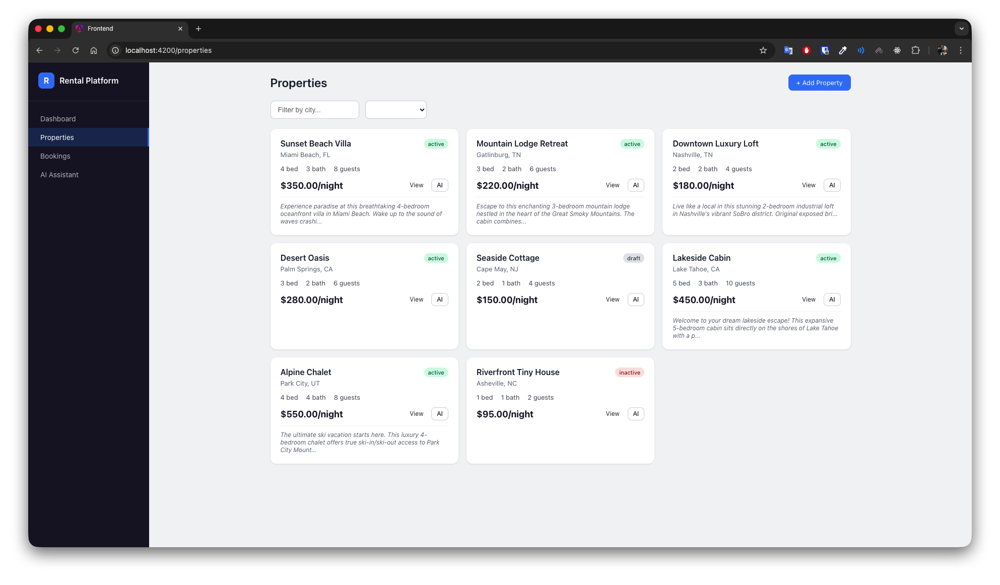
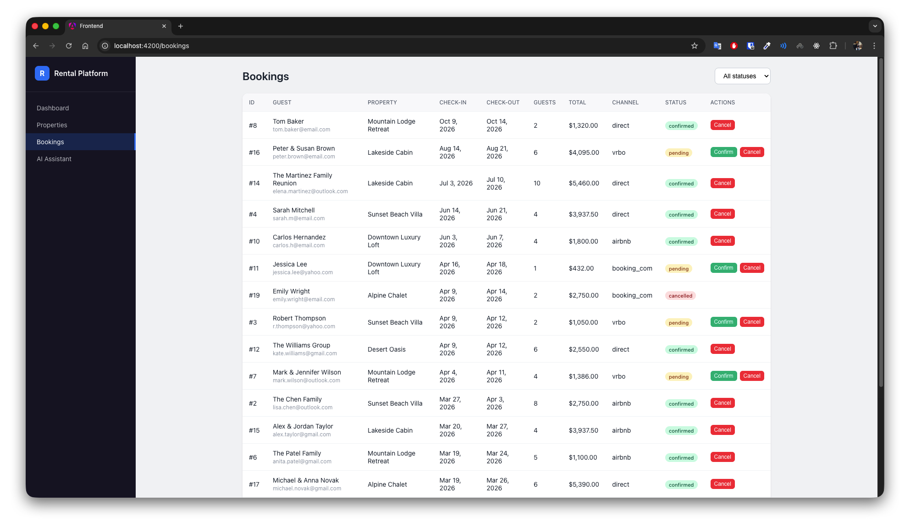
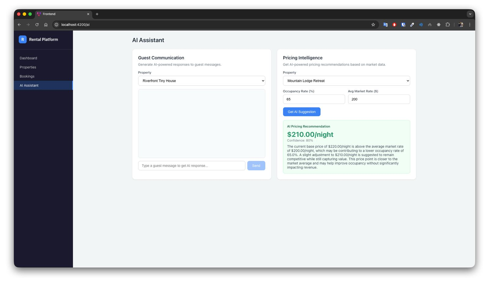

# Rental Platform

Shared platform API for vacation rental operators — core backend services consumed by multiple products (booking engine, channel manager, owner portal).

## Screenshots

| Dashboard | Properties |
|:-:|:-:|
|  |  |

| Bookings | AI Assistant |
|:-:|:-:|
|  |  |

## Architecture Overview

```
┌─────────────────────────────────────────────────────────────────────┐
│                         Presentation Layer                          │
│  ┌──────────┐  ┌───────────┐  ┌──────────┐  ┌───────────────────┐ │
│  │ Angular  │  │  REST API │  │ Webhook  │  │  Channel Ingest   │ │
│  │ Frontend │  │ Controllers│  │ Handlers │  │  (Airbnb, VRBO)   │ │
│  └────┬─────┘  └─────┬─────┘  └────┬─────┘  └────────┬──────────┘ │
└───────┼──────────────┼─────────────┼─────────────────┼─────────────┘
        │              │             │                 │
┌───────▼──────────────▼─────────────▼─────────────────▼─────────────┐
│                       Application Layer                             │
│                        (Use Cases / CQRS)                           │
│  ┌────────────────┐ ┌────────────────┐ ┌────────────────────────┐  │
│  │ CreateBooking   │ │ CheckAvail.    │ │ GenerateDescription    │  │
│  │ ConfirmBooking  │ │ CreateProperty │ │ GenerateGuestResponse  │  │
│  │ CancelBooking   │ │                │ │ SuggestPricing         │  │
│  └────────────────┘ └────────────────┘ └────────────────────────┘  │
└────────────┬───────────────────────┬───────────────────────────────┘
             │                       │
┌────────────▼───────────────────────▼───────────────────────────────┐
│                         Domain Layer (DDD)                          │
│                                                                     │
│  ┌─── Property Context ──┐  ┌─── Booking Context ──────────────┐   │
│  │  Aggregate: Property   │  │  Aggregate: Booking               │   │
│  │  VO: Address, Capacity │  │  VO: BookingStatus, GuestInfo     │   │
│  │  VO: PropertyStatus    │  │  Events: Created, Confirmed       │   │
│  └────────────────────────┘  └───────────────────────────────────┘   │
│                                                                     │
│  ┌─── Pricing Context ───┐  ┌─── Shared Kernel ─────────────────┐   │
│  │  PricingRule           │  │  VO: Money (cents + currency)      │   │
│  │  VO: PriceModifier     │  │  VO: DateRange (immutable period)  │   │
│  │  VO: ModifierType      │  │                                    │   │
│  └────────────────────────┘  └────────────────────────────────────┘   │
└────────────┬───────────────────────┬───────────────────────────────┘
             │                       │
┌────────────▼───────────────────────▼───────────────────────────────┐
│                     Infrastructure Layer                            │
│                                                                     │
│  ┌─────────────┐ ┌──────────────┐ ┌────────────────────────────┐   │
│  │  PostgreSQL  │ │    Redis     │ │      AI / LLM Agents       │   │
│  │  (Eloquent)  │ │  (Cache +    │ │  ┌─ Orchestrator ────────┐ │   │
│  │             │ │   Queues)    │ │  │  Guardrails Pipeline  │ │   │
│  │             │ │              │ │  │  Response Evaluator   │ │   │
│  │             │ │              │ │  │  Metrics & Monitoring │ │   │
│  └─────────────┘ └──────────────┘ │  └────────────────────────┘ │   │
│                                    │  ┌─ Guest Comm. Agent ───┐ │   │
│  ┌──────────────────────────────┐ │  │  Tool: lookup_property│ │   │
│  │     Event Bus / Listeners    │ │  │  Tool: lookup_booking │ │   │
│  │  BookingCreated → Cache Inv. │ │  │  Tool: check_avail   │ │   │
│  │  BookingConfirmed → Ch.Sync  │ │  └────────────────────────┘ │   │
│  └──────────────────────────────┘ │  ┌─ Pricing Advisor ─────┐ │   │
│                                    │  │  Tool: get_bookings   │ │   │
│  ┌──────────────────────────────┐ │  │  Tool: get_rules      │ │   │
│  │       Queue Workers          │ │  │  Tool: get_property   │ │   │
│  │  SyncChannelAvailability     │ │  └────────────────────────┘ │   │
│  │  GenerateAIDescription       │ └────────────────────────────┘   │
│  └──────────────────────────────┘                                   │
└─────────────────────────────────────────────────────────────────────┘
```

## Key Design Decisions

### 1. Domain-Driven Design (DDD)
- **Bounded Contexts**: Property, Booking, Pricing, and Shared Kernel are separate contexts with clear boundaries
- **Value Objects**: Immutable objects (`Money`, `DateRange`, `Address`, `BookingStatus`) enforce domain invariants at construction time
- **Aggregates**: Property and Booking are aggregate roots — all mutations go through them
- **Domain Events**: `BookingCreated`, `BookingConfirmed` decouple side effects from core logic

### 2. Hexagonal / Clean Architecture
Four layers with strict dependency direction (outer → inner):
- **Domain**: Pure business logic, no framework dependencies. Value Objects, Enums, Domain Events
- **Application**: Use Cases orchestrate domain objects. One class per use case (SRP)
- **Infrastructure**: Framework adapters — Eloquent, Redis, OpenAI, Queue workers
- **Presentation**: HTTP controllers, form requests, middleware

### 3. Contract-Driven Services (Ports & Adapters)
All platform services implement interfaces (`app/Contracts/`). This enables:
- Swapping implementations during legacy migration (Strangler Fig pattern)
- Easy testing with mocks/fakes
- Multiple products consuming the same service with different configurations

### 4. LLM Agent Architecture
AI features go beyond simple API calls:
- **Agent Orchestrator**: Manages agent lifecycle, retry logic, and tool-use loops
- **Guardrail Pipeline**: Input/output validation — PII detection, token limits, content policy
- **Response Evaluator**: Scores agent outputs on completeness, relevance, and accuracy
- **AI Metrics**: Real-time monitoring — latency percentiles, token usage, failure rates
- **Tool-Use Loop**: Agents can call tools (DB lookups, availability checks) autonomously
- **Graceful Degradation**: AI failures never block core operations

### 5. Multi-Tenant via Middleware
The `OperatorScope` middleware extracts tenant context from auth tokens, supporting both legacy API keys and modern JWT — enabling incremental migration.

### 6. Pessimistic Locking for Bookings
Double-booking prevention uses `lockForUpdate()` inside a DB transaction, not just application-level checks. This handles race conditions from concurrent requests across channels.

## Tech Stack

| Component | Technology | Why |
|-----------|-----------|-----|
| Backend | PHP 8.3 / Laravel 11 | Primary backend, modern PHP (readonly, enums, match) |
| Frontend | Angular 21 / TypeScript | Signals, standalone components, new control flow |
| Database | PostgreSQL 16 | JSONB for amenities, strong indexing, reliable |
| Cache/Queue | Redis 7 | Cache-aside for availability, queue backend for async jobs |
| AI | OpenAI-compatible API | Structured outputs, agent tool-use, model-agnostic |
| Container | Docker + docker-compose | Local dev parity with production |
| IaC | Terraform | AWS infrastructure: ECS Fargate, RDS, ElastiCache, ALB, CloudFront |
| Monitoring | CloudWatch + custom metrics | API latency, 5xx rates, AI agent performance |

## API Endpoints

| Method | Endpoint | Description |
|--------|----------|-------------|
| POST | `/v1/availability/check` | Check availability + get pricing quote |
| GET | `/v1/properties` | List properties (filterable) |
| POST | `/v1/properties` | Create property (triggers AI description) |
| POST | `/v1/bookings` | Create booking (with race condition protection) |
| POST | `/v1/bookings/{id}/confirm` | Confirm pending booking |
| POST | `/v1/ai/guest-response` | AI-generated guest communication |
| POST | `/v1/ai/properties/{id}/pricing-suggestion` | AI pricing recommendation |

## Running Locally

```bash
docker-compose up -d
docker-compose exec app php artisan migrate
docker-compose exec app php artisan db:seed
```

Frontend: http://localhost:4200 | API: http://localhost:8080/api/v1

## Running Tests

```bash
docker-compose exec app php artisan test
```

## Project Structure

```
app/
├── Domain/                    # Pure domain logic (no framework deps)
│   ├── Shared/ValueObjects/   # Money, DateRange
│   ├── Property/ValueObjects/ # Address, Capacity, PropertyStatus
│   ├── Booking/ValueObjects/  # BookingStatus, GuestInfo
│   └── Pricing/ValueObjects/  # PriceModifier, ModifierType
├── Application/               # Use Cases (one per business operation)
│   ├── Property/UseCases/     # CreateProperty
│   ├── Booking/UseCases/      # CreateBooking, ConfirmBooking, CancelBooking
│   ├── Availability/UseCases/ # CheckAvailability
│   └── AI/UseCases/           # GeneratePropertyDescription
├── Contracts/                 # Service interfaces (ports)
├── DTOs/                      # Data Transfer Objects
├── Events/                    # Domain events
├── Http/                      # Presentation layer
│   ├── Controllers/           # Thin controllers → delegate to use cases
│   ├── Middleware/             # Multi-tenant scoping
│   └── Requests/              # Input validation
├── Infrastructure/
│   └── AI/
│       ├── Agents/            # Agent orchestrator, tool-use agents
│       ├── Guardrails/        # PII detection, token limits
│       ├── Evaluation/        # Response quality scoring
│       └── Monitoring/        # Metrics collection
├── Jobs/                      # Async work (channel sync, AI generation)
├── Listeners/                 # Event handlers
├── Models/                    # Eloquent models (infrastructure)
├── Providers/                 # Service bindings + event registration
└── Services/                  # Service implementations (adapters)
    ├── AI/                    # OpenAI integration
    ├── Availability/          # Availability checking with cache
    └── Pricing/               # Dynamic pricing engine

infrastructure/
└── terraform/                 # AWS IaC
    ├── main.tf                # Provider config + state backend
    ├── vpc.tf                 # VPC with public/private subnets
    ├── ecs.tf                 # ECS Fargate (API + Worker)
    ├── rds.tf                 # PostgreSQL 16 (Multi-AZ in prod)
    ├── elasticache.tf         # Redis 7
    ├── alb.tf                 # Application Load Balancer + CloudFront
    ├── s3.tf                  # Assets + logs buckets
    ├── security.tf            # Security groups + IAM roles
    ├── monitoring.tf          # CloudWatch alarms + auto-scaling
    └── outputs.tf             # Deployment info

frontend/                      # Angular 21
└── src/app/
    ├── components/            # Dashboard, Properties, Bookings, AI Assistant
    ├── models/                # TypeScript interfaces
    └── services/              # HTTP services
```

## AWS Architecture (Terraform)

```
Internet → CloudFront (SPA) → S3
         → ALB (HTTPS) → ECS Fargate (API + Worker)
                           ├── RDS PostgreSQL (Multi-AZ)
                           ├── ElastiCache Redis
                           └── SSM Parameter Store (secrets)
```

- **Auto-scaling**: CPU-based (target 70%), 2-6 tasks
- **Monitoring**: CloudWatch alarms for latency (>2s), 5xx errors (>10/5min), RDS CPU (>80%)
- **Security**: Private subnets for compute/data, encrypted storage, least-privilege IAM
- **Cost optimization**: Single NAT in staging, gp3 storage, lifecycle policies on logs
